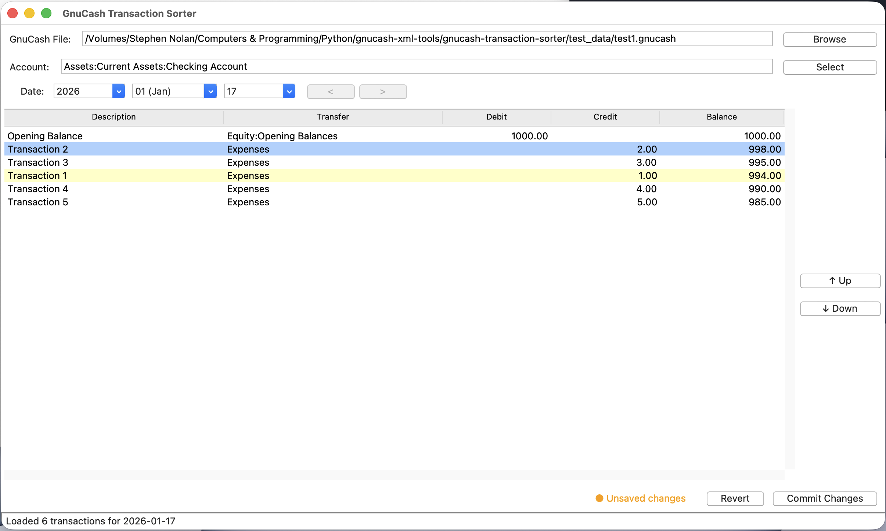

# GnuCash Transaction Sorter

A graphical tool for reordering transactions within a GnuCash account on a specific date.

## Overview

GnuCash stores multiple transactions on the same date ordered by their `<trn:date-entered>` timestamp. This application provides an intuitive interface to visually reorder those transactions and save the changes back to your GnuCash file.


*Screenshot showing the main interface with transaction reordering*

## Features

- ✅ **Visual Transaction Reordering** - Simple up/down buttons to change transaction order
- ✅ **Running Balance Display** - See real-time balance calculations as you reorder
- ✅ **Safe File Handling** - Automatic backups before saving changes
- ✅ **Lock File Management** - Prevents concurrent edits to the same file
- ✅ **Smart Account Selection** - Tree view showing only accounts with sortable transactions
- ✅ **Persistent Configuration** - Remembers your last file, account, and window position
- ✅ **Change Detection** - Prompts before discarding unsaved changes
- ✅ **System Theme Support** - Adapts to light/dark mode automatically
- ✅ **Tooltips** - Helpful hints for long descriptions and account names

## Installation

### Requirements

- Python 3.7 or higher
- tkinter (usually included with Python)
- No external dependencies required!

### Download

1. Download the `gnucash_transaction_sorter.py` file
2. Make it executable (Linux/Mac):
   ```bash
   chmod +x gnucash_transaction_sorter.py
   ```

That's it! The script is completely self-contained.

## Usage

### Basic Usage

Run the script:
```bash
python gnucash_transaction_sorter.py
```

Or on Linux/Mac:
```bash
./gnucash_transaction_sorter.py
```

### Workflow

1. **Select a GnuCash file** - Click "Browse" or click on the file path field
2. **Choose an account** - Click "Select" to open the account tree
3. **Pick a date** - Use the cascading dropdowns (only dates with 2+ transactions shown)
4. **Reorder transactions** - Select a transaction and use the ↑ Up / ↓ Down buttons
5. **Save changes** - Click "Commit Changes" when satisfied

### Command-Line Options

```bash
# Normal usage
python gnucash_transaction_sorter.py

# Reset window geometry if it's off-screen
python gnucash_transaction_sorter.py --reset-geometry

# Reset entire configuration to defaults
python gnucash_transaction_sorter.py --reset-config

# Use alternate config file location
python gnucash_transaction_sorter.py --config-file /path/to/config.json

# Enable debug output
python gnucash_transaction_sorter.py --debug
```

## How It Works

### Transaction Ordering in GnuCash

GnuCash uses two dates for each transaction:
- **date-posted** - The "official" transaction date (what you see in the register)
- **date-entered** - When the transaction was created/modified (used for ordering)

Transactions on the same `date-posted` are ordered by their `date-entered` timestamp.

### What This Tool Does

1. Reads your GnuCash XML file (handles both gzipped and plain XML)
2. Displays transactions for a selected account and date
3. Calculates running balances as you reorder
4. Updates `date-entered` timestamps to reflect your new order
5. Creates a timestamped backup before saving
6. Validates the modified XML before writing

### File Safety

- **Lock files** - Creates `.LCK` files to prevent concurrent access
- **Automatic backups** - Saves backup as `yourfile.gnucash.YYYYMMDDHHMMSS.gnucash`
- **XML validation** - Verifies modified XML before writing
- **Unsaved change detection** - Prompts before losing work

## Configuration

Settings are stored in `~/.gnucash_transaction_sorter.json`:

```json
{
  "last_file": "/path/to/your/file.gnucash",
  "last_account_guid": "account-guid-here",
  "last_date": "2026-01-15",
  "window_geometry": {
    "width": 1200,
    "height": 700,
    "x": 100,
    "y": 100
  },
  "column_widths": {
    "description": 250,
    "transfer": 250,
    "debit": 100,
    "credit": 100,
    "balance": 120
  }
}
```

## Troubleshooting

### File is locked

**Problem:** "This file is already open in GnuCash or another application"

**Solution:** Close the GnuCash file in other applications. If the lock file persists after closing GnuCash, manually delete the `.LCK` file.

### Window off-screen

**Problem:** Application window is not visible

**Solution:** 
```bash
python gnucash_transaction_sorter.py --reset-geometry
```

### Changes not visible in GnuCash

**Problem:** Reordered transactions don't appear in the correct order in GnuCash

**Solution:** Close and reopen the file in GnuCash. GnuCash caches the transaction order and needs to reload the file.

### Import errors

**Problem:** `ModuleNotFoundError` or import errors

**Solution:** Ensure you're using Python 3.7+ and have tkinter installed:
```bash
# Ubuntu/Debian
sudo apt-get install python3-tk

# Fedora
sudo dnf install python3-tkinter

# macOS (via Homebrew)
brew install python-tk
```

## Technical Details

### Architecture

The single-file script contains:
- **Data Models** - Account, Transaction, Split, AccountTransactionList
- **XML Parser** - Reads GnuCash XML files (handles compression)
- **XML Writer** - Updates transaction timestamps safely
- **Configuration Manager** - JSON-based settings persistence
- **GUI Components** - tkinter-based interface with multiple widgets
- **State Manager** - Handles application state and unsaved changes

### File Format Support

- ✅ Gzipped GnuCash files (`.gnucash`)
- ✅ Plain XML files (`.xml`)
- ✅ GnuCash 2.x and 3.x file formats

### Limitations

- Only works with XML-based GnuCash files (not SQL backend)
- Cannot reorder transactions across different dates
- Requires at least 2 transactions on a date to enable sorting

## Contributing

Contributions are welcome! Please feel free to submit pull requests or open issues for bugs and feature requests.

### Development

The code is extensively commented with high-level overviews for each module. Key sections:

- **Lines 1-100** - Overall documentation and imports
- **Lines 100-400** - Data models (Account, Transaction, Split)
- **Lines 400-900** - XML reading and parsing
- **Lines 900-1100** - XML writing and backup creation
- **Lines 1100-1400** - Configuration management
- **Lines 1400-1600** - GUI utilities
- **Lines 1600-2000** - Date selector and transaction table widgets
- **Lines 2000-2400** - Account selector dialog
- **Lines 2400-2800** - Main GUI and entry point

## License

MIT License.

## Acknowledgments

- Built for the [GnuCash](https://www.gnucash.org/) personal finance software
- Uses only Python standard library (tkinter, xml.etree, gzip, json)

## Support

If you find this tool useful, please:
- ⭐ Star this repository
- 🐛 Report bugs via GitHub issues
- 💡 Suggest features or improvements
- 📢 Share with other GnuCash users

## Changelog

### Version 1.0 (2026-01-19)
- Initial release
- Single-file implementation combining all modules
- Full feature set with GUI, file safety, and configuration persistence

---

**Happy Transaction Sorting! 📊💰**
