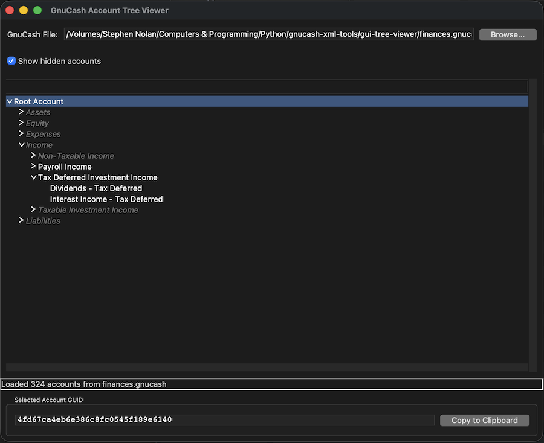

# GnuCash Account Tree GUI Viewer

A lightweight graphical application for browsing GnuCash account hierarchies and extracting account GUIDs. Built with Python's tkinter for a native look and feel across platforms.

 

## Features

- **Browse and visualize** GnuCash account hierarchies in an expandable tree view
- **Extract account GUIDs** for use in custom reports and scripts
- **Visual indicators** for placeholder and hidden accounts
- **One-click GUID copying** to clipboard
- **Persistent navigation** - tree state preserved when toggling display options
- **Cross-platform** - runs on Windows, macOS, and Linux
- **Zero dependencies** - uses only Python standard library

## Use Cases

- Quickly find account GUIDs for custom GnuCash report generation
- Visualize your account structure without opening GnuCash
- Identify placeholder accounts for hierarchical reporting
- Copy GUIDs for use with the `ACCOUNTS:` directive in report tools

## Installation

### Prerequisites

- Python 3.7 or higher
- tkinter (usually included with Python)

### Verify tkinter Installation

```bash
python3 -c "import tkinter; print('tkinter is installed')"
```

If tkinter is not installed:

**macOS (Homebrew):**
```bash
brew install python-tk@3.14  # Replace with your Python version
```

**Ubuntu/Debian:**
```bash
sudo apt-get install python3-tk
```

**Fedora:**
```bash
sudo dnf install python3-tkinter
```

**Arch Linux:**
```bash
sudo pacman -S tk
```

### Download

Clone this repository or download `gnucash_g_tree.py`:

```bash
git clone https://github.com/yourusername/gnucash-tree-viewer.git
cd gnucash-tree-viewer
```

## Usage

### Running the Application

```bash
python3 gnucash_g_tree.py
```

Or make it executable:

```bash
chmod +x gnucash_g_tree.py
./gnucash_g_tree.py
```

### Workflow

1. **Click "Browse..."** to select your GnuCash file (`.gnucash`, `.gnc`, or `.xml`)
2. The account tree loads automatically
3. **Expand/collapse** branches by clicking the triangles
4. **Click any account** to display its GUID
5. **Click "Copy to Clipboard"** to copy the GUID for use in reports

### Display Options

- **Show hidden accounts** - Toggle to show/hide accounts marked as hidden in GnuCash
- **Placeholder accounts** - Displayed in *gray italics* for easy identification

## Understanding the Display

- **Regular accounts** - Normal text (black)
- **Placeholder accounts** - *Gray italic text*
  - These are parent accounts that organize child accounts
  - Can be selected to report on all child accounts recursively
- **Hidden accounts** - Prefixed with `[HIDDEN]`
  - Accounts marked as hidden in GnuCash
  - Can be shown/hidden with the checkbox

## File Format Support

The application supports GnuCash XML files in both formats:
- **Compressed** - `.gnucash` files (gzip compressed XML)
- **Uncompressed** - `.gnc` or `.xml` files

## Technical Details

### How It Works

The application parses GnuCash XML files to extract:
- Account names and hierarchical relationships
- Account GUIDs (unique identifiers)
- Account properties (placeholder status, hidden flag)

### GnuCash XML Structure

The parser reads the following from GnuCash XML:
- `act:name` - Account name
- `act:id` - Account GUID
- `act:parent` - Parent account GUID
- `act:slots/slot[key='placeholder']` - Placeholder flag
- `act:slots/slot[key='hidden']` - Hidden flag

## Limitations

- **Read-only** - This tool only reads GnuCash files, it does not modify them
- **XML format only** - Does not support SQLite-based GnuCash files
- **No live updates** - Must reload to see changes made in GnuCash

## Use with Custom Reports

Account GUIDs extracted with this tool can be used in custom GnuCash reporting scripts. For example, using the `ACCOUNTS:` directive to report on an entire account hierarchy:

```
ACCOUNTS: <placeholder-account-guid>
```

This will include all child accounts under the specified placeholder account.

## Contributing

Contributions are welcome! Please feel free to submit a Pull Request.

### Ideas for Enhancement

- Add search/filter functionality
- Display additional account properties (type, code, description)
- Export account tree to CSV or JSON
- Support for SQLite-based GnuCash files
- Account balance display (requires parsing transaction data)

## License

This project is released under the MIT License. See LICENSE file for details.

## Author

Created to help developers and power users work more efficiently with GnuCash account structures.

## Acknowledgments

- GnuCash project for maintaining excellent XML documentation
- The Python community for robust standard library XML tools
- Uses Python's built-in tkinter for cross-platform GUI support
